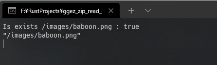
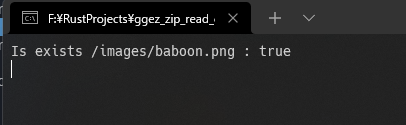

# ggez zip `read_dir()` test

My environments:
- Windows 11 Pro
- stable-x86_64-pc-windows-msvc (default) rustc 1.57.0 (f1edd0429 2021-11-29)
- ggez v0.7.0 (https://github.com/ggez/ggez?branch=devel#56fc4ac3)

---

The source code that uses the filesystem is as follows:

```rust
impl MyGame {
    pub fn new(ctx: &mut Context) -> MyGame {
        let mut images = vec![];

        let exist_img = filesystem::exists(ctx, "/images/baboon.png");
        println!("Is exists /images/baboon.png : {}", exist_img);

        for p in filesystem::read_dir(ctx, "/images/").unwrap() {
            println!("{:?}", p);
            let image = Image::new(ctx, p).unwrap();
            images.push(image);
        }

        MyGame { _images: images }
    }
}
```

And the hierarchy of the resources directory is as follows:

```
/resources/
└─ images/
    └─ baboon.png
```

This executable should be outputs like this:

```
Is exists /images/baboon.png : true
"/images/baboon.png"
```

If you run `test_no_zip/ggez_zip_read_dir_test.exe`, you get outputs like this correctly:



But, if you run `test_zip/ggez_zip_read_dir_test.exe`, you get outputs like this incorrectly:



This is due to the fact that `read_dir()` for zip files is not working properly on Windows 11.
